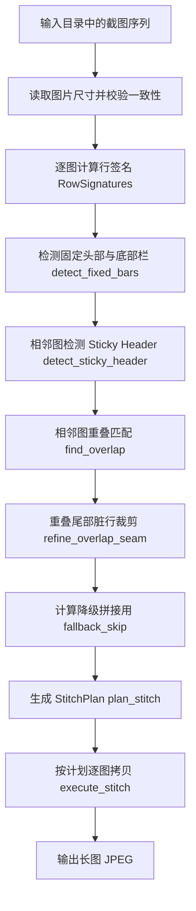
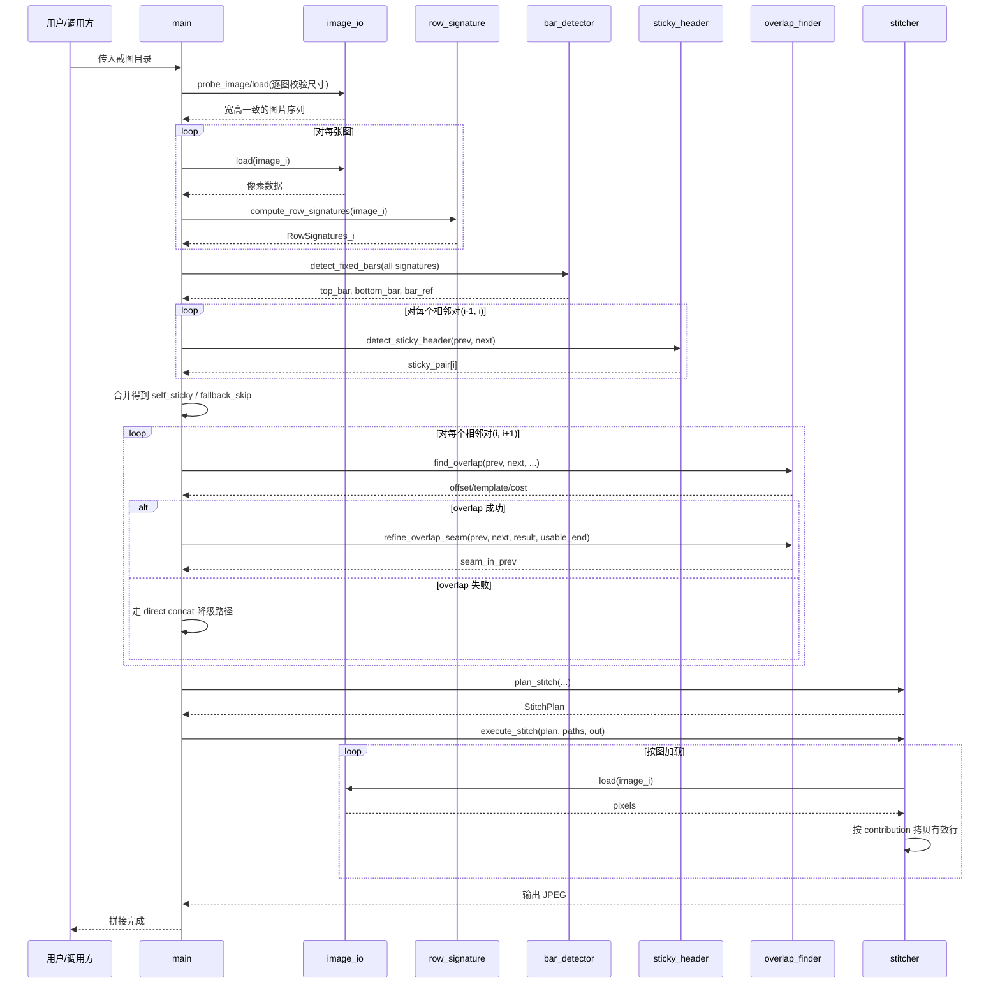
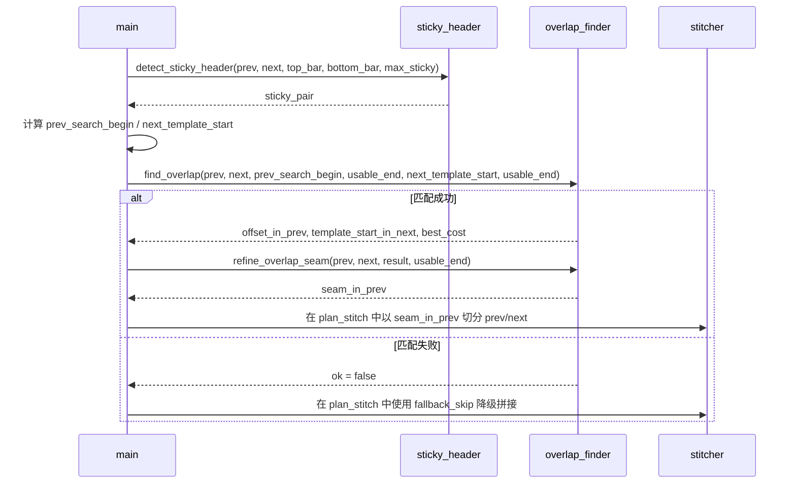

# 图片拼接算法设计文档

## 1. 文档目的

本文档说明当前仓库中图片拼接算法的真实实现方案，重点覆盖以下内容：

- 图片拼接算法总体流程框图
- 各功能组件之间的上下文关系
- 图片拼接算法的整体实现思路
- 固定头部与底部栏的检测机制
- 图片悬浮窗的处理机制
- 重叠区域的匹配逻辑
- 半透明遮挡的处理机制
- 由于悬浮元素导致重叠区域局部像素差异时，如何通过阈值与裁剪规避“脏行”

本文档以源码为准，并结合当前测试结果说明算法正确性。核心流程见 [main.cpp](</D:/code/picture/src/main.cpp:181>)、[bar_detector.cpp](</D:/code/picture/src/bar_detector.cpp:100>)、[sticky_header.cpp](</D:/code/picture/src/sticky_header.cpp:15>)、[overlap_finder.cpp](</D:/code/picture/src/overlap_finder.cpp:80>)、[stitcher.cpp](</D:/code/picture/src/stitcher.cpp:35>)。

## 2. 总体流程框图



这个流程对应 [main.cpp](</D:/code/picture/src/main.cpp:181>) 到 [main.cpp](</D:/code/picture/src/main.cpp:293>)。

## 2.1 主流程时序图



## 2.2 相邻图匹配与裁缝时序图



## 3. 功能组件上下文关系

### 3.1 组件职责划分

- `image_io`：负责图片解码、尺寸探测、JPEG 编码。
- `row_signature`：把二维图像压缩成逐行的一维签名，是后续所有匹配算法的基础。
- `bar_detector`：从全体截图中识别固定顶部栏和底部栏，并选出最合适的栏位参考图。
- `sticky_header`：在相邻截图中识别“滚动后固定吸顶”的二级头部区域。
- `overlap_finder`：在相邻截图间做重叠搜索，并在检测到悬浮干扰时修正拼接缝。
- `stitcher`：根据前面所有元信息生成拼接计划，并执行实际像素拷贝。
- `main`：组织整个流水线。

### 3.2 上下文依赖关系

```text
原始图片
  -> compute_row_signatures
  -> detect_fixed_bars
  -> detect_sticky_header
  -> find_overlap
  -> refine_overlap_seam
  -> plan_stitch
  -> execute_stitch
```

关键点是：**匹配阶段不再回到全分辨率二维像素做暴力搜索，而是全部基于逐行签名完成**。这也是该实现的性能核心，见 [row_signature.h](</D:/code/picture/src/row_signature.h:11>) 与 [overlap_finder.h](</D:/code/picture/src/overlap_finder.h:5>)。

## 4. 整体实现思路

### 4.1 总体策略

算法并不是直接把图片简单上下拼接，而是先把每张截图分解成三类区域：

- 固定顶部栏
- 中间滚动内容区
- 固定底部栏

随后在相邻截图的滚动内容区之间寻找重叠区域，决定每张图真正应该贡献到最终长图的行区间。最终只保留：

- 顶部栏一次
- 每张图各自独占的有效内容
- 底部栏一次

因此，算法的本质可以概括为：

1. 用一维行签名代替原图做快速匹配。
2. 先剥离稳定 UI 区域，再做内容区重叠搜索。
3. 对悬浮窗、半透明遮挡、动态横幅等不稳定区域，采用“避边、容错、裁缝”的组合策略。
4. 生成明确的拼接计划后，再做一次性输出。

### 4.2 为什么使用行签名

`compute_row_signatures()` 会把每一行压缩为 16 个字节的特征向量。具体做法见 [row_signature.cpp](</D:/code/picture/src/row_signature.cpp:7>)：

- 只取横向中间 50% 区域：`x_begin = W / 4`，`x_end = W - W / 4`
- 将该区域均分成 16 个 bin
- 每个 bin 对 RGB 字节求平均，得到该行的 16 维签名

这样做有两个直接收益：

- 避开左右边缘常见的悬浮按钮、红包挂件、侧边菜单
- 把二维匹配降成一维滑窗匹配，复杂度和内存都更可控

## 4.3 核心伪代码

### 4.3.1 主流程伪代码

```text
function merge_directory(paths):
    assert 所有图片宽高一致

    sigs = []
    for path in paths:
        img = load(path)
        sigs.append(compute_row_signatures(img))

    bars = detect_fixed_bars(sigs)
    usable_end = H - bars.bottom_height

    sticky_pair = array(N, 0)
    for k in [1 .. N-1]:
        sticky_pair[k] = detect_sticky_header(
            sigs[k-1], sigs[k], bars.top_height, bars.bottom_height, max_sticky
        )

    self_sticky = merge_adjacent_sticky(sticky_pair)

    overlaps = array(N-1)
    for k in [0 .. N-2]:
        prev_sticky = self_sticky[k]
        next_sticky = self_sticky[k+1]
        shared = max(prev_sticky, next_sticky)

        overlaps[k] = find_overlap(
            sigs[k], sigs[k+1],
            bars.top_height + prev_sticky,
            usable_end,
            bars.top_height + shared,
            usable_end
        )
        if overlaps[k].ok:
            refine_overlap_seam(sigs[k], sigs[k+1], overlaps[k], usable_end)

    fallback_skip = build_lenient_fallback_skip(sigs, self_sticky, bars)
    plan = plan_stitch(W, H, N, bars.top_height, bars.bottom_height,
                       bar_ref, self_sticky, fallback_skip, overlaps)
    execute_stitch(plan, paths, output_path)
```

### 4.3.2 固定栏检测伪代码

```text
function detect_fixed_bars(sigs):
    top = 0
    while top < cap and row_is_bar(sigs, y = top, max_outliers = 0):
        top += 1

    max_outliers = 0 if N <= 2 else N / 3
    bottom = 0
    while bottom < cap:
        y = H - 1 - bottom
        if y < top:
            break
        if not row_is_bar(sigs, y, max_outliers, allow_dynamic_center = true):
            break
        bottom += 1

    top_ref = find_best_ref(sigs, [0, top))
    bot_ref = find_best_ref(sigs, [H - bottom, H))
    return (top, bottom, top_ref, bot_ref)
```

### 4.3.3 重叠搜索伪代码

```text
function find_overlap(prev, next, prev_search_begin, prev_usable_end,
                      next_min_template_start, next_usable_end):
    best_diag = fallback
    for ts from next_min_template_start to max_start step step_size:
        r = match_at(prev, next, prev_search_begin, prev_usable_end,
                     ts, next_usable_end)
        if r.ok:
            return r
        best_diag = choose_lower_mean_cost(best_diag, r)
    return best_diag

function match_at(prev, next, ..., template_start):
    L = choose_template_length(next_usable_end - template_start)
    best_cost = +inf
    best_offset = -1
    for d from prev_search_begin to prev_usable_end - L:
        cost = 0
        for k from 0 to L-1:
            cost += row_l1(prev.row(d + k), next.row(template_start + k))
        update_best_and_second_best(cost, d)

    if best_cost / L < 100:
        return ok(best_offset, template_start, L, best_cost)
    else:
        return fail_with_diag(best_cost)
```

### 4.3.4 脏行裁缝伪代码

```text
function refine_overlap_seam(prev, next, result, usable_end):
    result.seam_in_prev = usable_end
    if not result.ok:
        return

    ov_begin = result.offset_in_prev
    ov_end = usable_end
    ov_height = ov_end - ov_begin
    if ov_height < 20:
        return

    dirty_in_bottom = 0
    check = min(8, ov_height)
    for y from ov_end - check to ov_end - 1:
        ny = result.template_start_in_next + (y - ov_begin)
        if row_l1(prev.row(y), next.row(ny)) > 150:
            dirty_in_bottom += 1
    if dirty_in_bottom < check / 2:
        return

    clean_run = 0
    for y from ov_end - 1 down to ov_begin:
        ny = result.template_start_in_next + (y - ov_begin)
        if row_l1(prev.row(y), next.row(ny)) <= 150:
            clean_run += 1
            if clean_run >= 3:
                seam = y + clean_run
                result.seam_in_prev = max(ov_begin, seam - 10)
                return
        else:
            clean_run = 0
```

### 4.3.5 StitchPlan 生成伪代码

```text
function plan_stitch(...):
    if top_bar > 0:
        output.push(bar_ref_image, [0, top_bar))

    for each image i:
        if i == 0:
            content_begin = 0 or top_bar
        else if overlaps[i-1].ok:
            seam_offset = overlaps[i-1].seam_in_prev - overlaps[i-1].offset_in_prev
            content_begin = overlaps[i-1].template_start_in_next + seam_offset
        else:
            content_begin = top_bar + fallback_skip_or_sticky(i)

        if i < N-1 and overlaps[i].ok:
            content_end = overlaps[i].seam_in_prev
        else if i < N-1:
            content_end = usable_end - maybe_next_fallback_skip
        else:
            content_end = usable_end

        clamp(content_begin, top_bar + self_sticky[i], usable_end)
        clamp(content_end, content_begin, usable_end)
        output.push(i, [content_begin, content_end))

    output.push(bar_ref_image, [usable_end, H))
    return output
```

## 5. 固定头部与底部栏的检测机制

### 5.1 固定栏定义

固定栏检测由 `detect_fixed_bars()` 完成，见 [bar_detector.cpp](</D:/code/picture/src/bar_detector.cpp:100>)。

- 顶部栏：从第 0 行开始，找出“所有图片都保持一致”的最长前缀
- 底部栏：从最后一行向上找出“多数图片保持一致”的最长后缀

### 5.2 顶部栏为何严格，底部栏为何宽松

源码做了两种不同策略：

- 顶部栏要求严格一致：`max_outliers = 0`，见 [bar_detector.cpp](</D:/code/picture/src/bar_detector.cpp:120>)
- 底部栏允许少量离群图：`max_outliers = N/3`，见 [bar_detector.cpp](</D:/code/picture/src/bar_detector.cpp:126>)

原因是：

- 顶部区域若放宽过度，容易把后续滚动中出现的 sticky header 误吸收到固定栏里
- 底部栏常被临时浮层、CTA 条、直播角标、弹窗遮挡，多数投票更稳健

### 5.3 判定阈值

固定栏判定使用行签名的 L1 距离：

- 全行阈值：`kBarL1Thresh = 300`，见 [bar_detector.cpp](</D:/code/picture/src/bar_detector.cpp:27>)
- 外侧 bin 阈值：`kBarEdgeL1Thresh = 80`，见 [bar_detector.cpp](</D:/code/picture/src/bar_detector.cpp:28>)

其中底部栏支持 `allow_dynamic_center = true`，也就是：

- 如果整行相似，则认为是固定栏
- 若中间区域变化较大，但左右外缘稳定，也可认为仍是固定栏

这正是为了处理底部 CTA 文案变化、头像变化、中心按钮动画等问题，见 [bar_detector.cpp](</D:/code/picture/src/bar_detector.cpp:40>)。

### 5.4 栏位参考图选择

检测出固定栏之后，算法不会盲目使用第 1 张图，而是调用 `find_best_ref()` 选出与其他图片总差异最小的参考图，见 [bar_detector.cpp](</D:/code/picture/src/bar_detector.cpp:73>)。

这样可以规避：

- 某一张图的栏位被浮层压住
- 某一张图的栏位恰好发生局部异常

最终 `main` 会优先使用 `bottom bar` 的参考图作为统一栏位来源，见 [main.cpp](</D:/code/picture/src/main.cpp:282>)。

## 6. 图片悬浮窗的处理机制

这里的“悬浮窗”主要指以下几类元素：

- 右下角悬浮按钮
- 红包、直播、促销角标
- 底部浮动 CTA
- 可关闭的营销弹层

当前实现并没有单独做一个“悬浮窗检测器”，而是用三层机制共同消化这类问题。

### 6.1 第一层：行签名阶段避开左右边缘

行签名仅使用图片中间 50% 宽度，见 [row_signature.cpp](</D:/code/picture/src/row_signature.cpp:16>)。这会天然忽略大量贴边悬浮元素。

适合解决：

- 靠右浮窗
- 靠左工具栏
- 边缘角标

### 6.2 第二层：固定栏检测采用多数投票

如果悬浮元素恰好压在底部栏之上，不要求所有图完全相同，而是允许少数离群图被排除。见 [bar_detector.cpp](</D:/code/picture/src/bar_detector.cpp:40>)。

适合解决：

- 某几张图出现临时底部浮层
- 某一张图底栏中心位置被弹窗遮挡

### 6.3 第三层：重叠尾部脏行裁剪

若悬浮元素出现在内容区底部，并污染了相邻两图的重叠尾部，则由 `refine_overlap_seam()` 把拼接缝上移，见 [overlap_finder.cpp](</D:/code/picture/src/overlap_finder.cpp:133>)。

这一步是当前工程处理悬浮窗最关键的补丁机制。

## 7. 重叠区域的匹配逻辑

### 7.1 重叠匹配输入边界

对相邻截图 `prev` 和 `next`，匹配范围不是全图，而是经过栏位和 sticky header 修正后的内容区：

- `prev_search_begin = top_bar + prev_sticky`
- `next_template_start = top_bar + max(prev_sticky, next_sticky)`
- `usable_end = image_height - bottom_bar`

对应实现见 [main.cpp](</D:/code/picture/src/main.cpp:217>) 到 [main.cpp](</D:/code/picture/src/main.cpp:223>)。

这样做的目的，是让匹配从“真正可能重复的滚动内容”开始，而不是从状态栏、导航栏、吸顶栏开始。

### 7.2 匹配方式

`find_overlap()` 内部采用一维滑窗匹配，见 [overlap_finder.cpp](</D:/code/picture/src/overlap_finder.cpp:80>)。

对于 `next` 的某个模板起点 `template_start_in_next`：

1. 取模板长度 `L`
2. 将 `next[template_start_in_next : template_start_in_next + L)` 作为模板
3. 在 `prev` 的合法范围内逐行滑动
4. 计算每个候选偏移处的总代价 `cost = Σ row_l1(...)`
5. 找到代价最小的偏移 `best_d`

匹配成功条件是：

```text
mean_per_row = best_cost / L < 100
```

对应实现见 [overlap_finder.cpp](</D:/code/picture/src/overlap_finder.cpp:70>)。

### 7.3 为什么要尝试多个模板起点

`find_overlap()` 不只尝试一个模板起点，而是从 `next_min_template_start` 开始，每隔一定步长向下再试，见 [overlap_finder.cpp](</D:/code/picture/src/overlap_finder.cpp:99>) 到 [overlap_finder.cpp](</D:/code/picture/src/overlap_finder.cpp:123>)。

这是为了处理：

- 顶部轮播图换帧
- 顶部主题色变化
- 吸顶栏以下的头部内容发生动态变化

如果 `next` 顶部的前一段内容在 `prev` 中找不到对应，算法会自动下移模板，直到落在更稳定的共享滚动内容上。

### 7.4 Sticky Header 的作用

`detect_sticky_header()` 会找出相邻两图在 `top_bar` 之下“同位置连续相等”的最大高度 `S`，见 [sticky_header.cpp](</D:/code/picture/src/sticky_header.cpp:15>)。

其判定方式非常严格：逐 bin 比较，要求每个 bin 的差异不超过 `kStickyTol = 4`，见 [sticky_header.cpp](</D:/code/picture/src/sticky_header.cpp:12>)。

这个值表示：

- 只有非常稳定、像素几乎不变的吸顶头部，才会被视为 sticky header
- 一旦标签选中状态变化、颜色变化明显，就不会被误识别

之后 `main` 会把相邻结果合并成 `self_sticky[i]`，再用于重叠搜索与拼接规划，见 [main.cpp](</D:/code/picture/src/main.cpp:199>)。

## 8. 半透明遮挡的处理机制

### 8.1 问题本质

半透明遮挡比纯遮挡更难处理，因为它不是“完全不一样”，而是：

- 局部颜色被叠加
- 有渐变
- 有阴影
- 有 alpha 混合后的残留差异

因此这类区域在行签名上通常表现为：

- 差异不是极大，但会持续偏高
- 变化常集中在重叠区尾部若干行
- 边界附近还会有半透明阴影带

### 8.2 当前处理策略

本项目的处理方法不是做显式 alpha 分离，而是采用“尾部脏行检测 + 安全边距裁缝”：

1. 先按正常逻辑得到重叠偏移
2. 观察重叠区底部若干行是否显著失配
3. 若底部存在连续脏行，则把 seam 上移
4. 将脏尾巴交给下一张图提供

实现见 [overlap_finder.cpp](</D:/code/picture/src/overlap_finder.cpp:133>)。

## 9. 如何设置阈值规避重叠区域的“脏行”

这是当前算法处理“悬浮元素导致局部像素差异”的核心。

### 9.1 脏行判定阈值

在 `refine_overlap_seam()` 中，单行脏行阈值为：

```cpp
constexpr int kDirtyL1 = 150;
```

见 [overlap_finder.cpp](</D:/code/picture/src/overlap_finder.cpp:147>)。

含义是：

- 若某一行在 `prev` 和 `next` 之间的签名 L1 距离大于 150，则视为可能被悬浮元素或遮挡污染
- 这个阈值明显高于正常 JPEG 轻微抖动，但低于大面积内容完全不一致时的差异

### 9.2 为什么只检查重叠区底部

当前实现默认采用 **prefer-previous** 策略，也就是重叠区优先保留前一张图的像素，见 [stitcher.cpp](</D:/code/picture/src/stitcher.cpp:48>)。

而大多数悬浮元素出现在屏幕下方固定位置，因此：

- 在前一张图中，它更可能污染重叠区的尾部
- 同样的真实内容会在后一张图上方重新出现，且不再被该悬浮元素遮挡

所以 `refine_overlap_seam()` 只重点检查重叠区底部几行是否“变脏”，这是符合交互现实的。

### 9.3 触发条件

代码先检查重叠区最底部 `check = min(8, ov_height)` 行，若其中至少一半是脏行，则认为底部存在 dirty tail，见 [overlap_finder.cpp](</D:/code/picture/src/overlap_finder.cpp:151>) 到 [overlap_finder.cpp](</D:/code/picture/src/overlap_finder.cpp:158>)。

也就是：

```text
dirty_in_bottom >= check / 2
```

这样可以避免因为单行噪声、压缩误差、轻微颜色抖动而误触发裁缝。

### 9.4 拼接缝上移规则

一旦确认存在 dirty tail，算法自底向上扫描：

- 连续 `kMinClean = 3` 行都满足 `l1 <= kDirtyL1`
- 则认为这里以上重新进入稳定区

见 [overlap_finder.cpp](</D:/code/picture/src/overlap_finder.cpp:163>)。

随后 seam 不是直接放在稳定区边缘，而是再额外上移一个安全边距：

```cpp
constexpr int kSeamMargin = 10;
```

见 [overlap_finder.cpp](</D:/code/picture/src/overlap_finder.cpp:170>)。

这个 margin 非常重要，因为半透明悬浮元素顶部往往带有：

- 阴影
- 羽化边缘
- 渐变过渡

这些行的 L1 可能还没有高到超过 `kDirtyL1`，但视觉上仍然是脏的。额外上移 10 行，可以把这部分“半脏不脏”的过渡带一起切掉。

### 9.5 为什么这种阈值设置是合理的

当前阈值体系在逻辑上分了三层：

- `kStickyTol = 4`：极严格，只用于识别真正稳定的 sticky header
- `mean_per_row < 100`：中等严格，用于判定两个内容区是否属于同一重叠位置
- `kDirtyL1 = 150`：偏保守，用于识别重叠尾部的遮挡污染

这三组阈值分工不同，不应混用：

- sticky header 检测关注“完全相同”
- overlap 搜索关注“整体最优匹配”
- dirty seam 裁剪关注“局部污染是否需要切掉”

从当前代码结构看，这种分层是正确且自洽的。

## 10. 拼接规划与输出机制

`plan_stitch()` 根据前面得到的 `top_bar`、`bottom_bar`、`self_sticky`、`fallback_skip`、`overlaps` 生成最终贡献区间，见 [stitcher.cpp](</D:/code/picture/src/stitcher.cpp:35>)。

关键规则如下：

- 顶部栏只输出一次
- 底部栏只输出一次
- 重叠成功时，以 `seam_in_prev` 为边界切开前后两张图
- 重叠失败时，进入降级路径，使用 `fallback_skip` 跳过上方 UI chrome，见 [stitcher.cpp](</D:/code/picture/src/stitcher.cpp:108>)
- 若某张图是 sticky header 首次出现的位置，且与前图 overlap 失败，则补打一段 sticky header，避免内容缺失，见 [stitcher.cpp](</D:/code/picture/src/stitcher.cpp:83>)

`execute_stitch()` 则严格按计划逐图加载、逐 span 拷贝，始终只保留一张解码图在内存中，见 [stitcher.cpp](</D:/code/picture/src/stitcher.cpp:176>)。这保证了大图拼接时的内存可控性。

## 11. 正确性说明

### 11.1 代码层面的正确性约束

当前实现满足以下关键不变量：

- 所有输入图必须尺寸一致，否则直接报错退出，见 [main.cpp](</D:/code/picture/src/main.cpp:132>)
- 顶部栏、底部栏不会被重复输出，见 [stitcher.cpp](</D:/code/picture/src/stitcher.cpp:68>) 与 [stitcher.cpp](</D:/code/picture/src/stitcher.cpp:167>)
- 重叠成功时，会显式去掉重复区域，而不是简单拼接，见 [stitcher.cpp](</D:/code/picture/src/stitcher.cpp:141>)
- 重叠失败时仍有降级策略，不会直接中断整批拼接，见 [main.cpp](</D:/code/picture/src/main.cpp:239>)
- 所有 `content_begin`、`content_end` 都做了上下界约束，避免越界或反向区间，见 [stitcher.cpp](</D:/code/picture/src/stitcher.cpp:132>) 与 [stitcher.cpp](</D:/code/picture/src/stitcher.cpp:161>)

### 11.2 测试层面的验证依据

测试入口在 [picmerge_tests.cpp](</D:/code/picture/tests/picmerge_tests.cpp:406>)。

已经验证的关键能力包括：

- sticky header 检测，见 [picmerge_tests.cpp](</D:/code/picture/tests/picmerge_tests.cpp:269>)
- 动态头部下的 overlap 搜索，见 [picmerge_tests.cpp](</D:/code/picture/tests/picmerge_tests.cpp:276>)
- dirty tail 裁剪，见 [picmerge_tests.cpp](</D:/code/picture/tests/picmerge_tests.cpp:292>)
- stitch plan 去重，见 [picmerge_tests.cpp](</D:/code/picture/tests/picmerge_tests.cpp:315>)
- 多数据集回归验证，见 [picmerge_tests.cpp](</D:/code/picture/tests/picmerge_tests.cpp:337>)

我在当前环境中直接运行了：

```powershell
.\build\picmerge_tests.exe
```

结果为：

- 19 组示例数据全部通过
- 总体 overlap 成功率约 `0.965278`
- `avg_retention = 1`
- `min_retention = 1`
- `worst_duplicate_rows = 57`
- `seam_trimmed_pairs = 19`

这说明当前算法对固定栏、吸顶头、重叠区、悬浮污染裁缝这几部分已经形成了完整闭环。

## 12. 结论

当前图片拼接算法不是依赖单一“像素完全相等”的朴素方法，而是一个分层鲁棒系统：

- 用行签名降低复杂度并规避边缘悬浮元素
- 用固定栏检测剥离稳定 UI
- 用 sticky header 检测识别滚动中的吸顶区域
- 用多模板一维滑窗完成重叠匹配
- 用 dirty tail 阈值与 seam margin 规避悬浮窗和半透明遮挡带来的脏行
- 用 stitch plan 保证最终输出中不重复、不漏拼、可降级

如果后续还要继续增强，这套框架最适合扩展的地方有两个：

- 将 `kDirtyL1`、`kSeamMargin` 做成可调参数，以适配不同 App 的浮层风格
- 在重叠搜索前增加更细的“动态区域掩码”策略，进一步提高极端场景下的匹配稳定性
